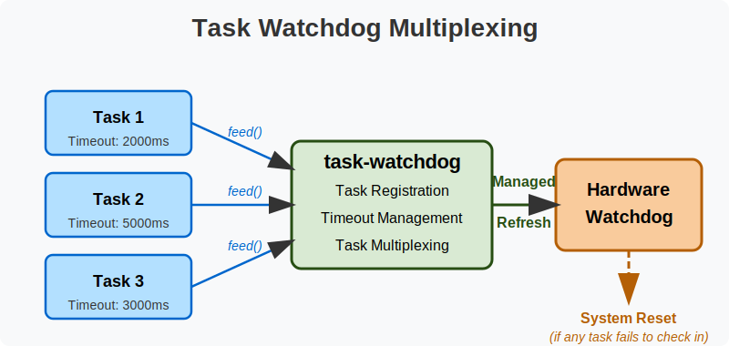

# 🛡️ task-watchdog

A robust, flexible watchdog management library for embedded systems that multiplexes multiple task watchdogs into a single hardware watchdog timer, preventing system lockups when tasks fail to respond.

## ✨ Key Features

- **🔄 Hardware Agnostic API**: Implements a consistent interface across different embedded microcontrollers with extensible trait system for hardware watchdog and clock types
- **🔀 Task Multiplexing**: Consolidates multiple independent task watchdogs into a single hardware watchdog, triggering if any task fails to check in
- **🔌 Dynamic Task Management**: Tasks can be registered and deregistered at runtime, allowing for flexible monitoring configurations
- **⚡ Async and Sync Support**: Works with both synchronous (via device HALs) and asynchronous (Embassy) execution environments
- **📦 No-Alloc Mode**: Functions in both `alloc` and `no_alloc` modes for environments with or without heap availability
- **⏱️ Configurable Timeouts**: Individual timeout durations for each registered task
- **🧪 `no_std` Compatible**: Designed for resource-constrained embedded environments without an operating system

## 🚀 Quick Start

Examples are provided for async (using embassy-rs) and sync operation of `task-watchdog`.  The async/embassy example supports the Pico, Pico 2 and STM32F103C8 (blue pill).  The sync example supports the Pico and Pico 2.

First, [install Rust](https://www.rust-lang.org/tools/install)

Add the approriate target(s):

```bash
rustup target add thumbv6m-none-eabi         # RP2040/Pico
rustup target add thumbv8m.main-none-eabihf  # RP235x/Pico 2
rustup target add thumbv7m-none-eabi         # STM32
```

Next, [install probe-rs](https://probe.rs/docs/getting-started/installation/)

Now connect your Pico/Pico 2/STM321F103C8 device to a connected debug probe, and run one of:

```bash
builds/flash-async-pico.sh
builds/flash-async-pico2.sh
builds/flash-async-stm32f103c8.sh
```

To understand how to use `task-watchdog` yourself, check out one of the examples:
* [`async.rs`](examples/src/async.rs) - Pico/Pico 2/STM32
* [`rp-sync.rs`](examples/src/rp-sync.rs) - Pico/Pico 2

## 📝 Usage

The library supports both synchronous and asynchronous APIs with a consistent pattern across both styles.

### 🧠 Core Concepts

- **Task Registration**: Each monitored task is registered with its own timeout period
- **Feeding**: Tasks must feed, or pet, the watchdog within their timeout period to prevent a reset
- **Task Multiplexing**: The library efficiently manages multiple task timeouts through a single hardware watchdog, triggering if any individual task fails to check in



###⚡Asynchronous API (Embassy)

For platforms using Embassy, tasks feed the watchdog asynchronously:

```Rust
// Setup
let watchdog = WatchdogRunner::new(hw_watchdog, config, EmbassyClock);

// Register tasks with individual timeouts
watchdog.register_task(&MainTask, Duration::from_millis(2000)).await;
watchdog.register_task(&SensorTask, Duration::from_millis(5000)).await;

// Spawn the watchdog task itself
spawner.spawn(watchdog_task(watchdog)).unwrap();

// In your application tasks
async fn main_task(watchdog: &'static WatchdogRunnerType) -> ! {
    loop {
        // Do work...
        watchdog.feed(&MainTask).await;
        Timer::after(Duration::from_millis(1000)).await;
    }
}

// Implement other tasks
```

See complete example at [`examples/src/async.rs`](examples/src/async.rs)

### ⚙️ Synchronous API (non-Embassy)

For platforms without an async runtime, manually manage the watchdog in your main loop:

```rust
// Setup
let mut watchdog = Watchdog::<TaskId, NUM_TASK_IDS, RpHalTaskWatchdog, RpHalClock>::new(
    hw_watchdog, config, RpHalClock::new(timer)
);

// Register tasks with individual timeouts
watchdog.register_task(&TaskId::Main, RpHalDuration::millis(2000));
watchdog.register_task(&TaskId::Sensors, RpHalDuration::millis(3000));

// Start the watchdog
watchdog.start();

// In your main loop
loop {
    // Feed watchdogs for active tasks
    watchdog.feed(&TaskId::Main);
    
    // Check for starved tasks
    let _ = watchdog.check();
}
```

See complete example at [`examples/src/rp-sync.rs`](examples/src/rp-sync.rs)

## 🏗️ Platform Support

The crate is designed to be platform-agnostic via trait implementations, but includes first-class support for:

- RP2040 and RP2350 (Raspberry Pi Pico and Pico 2) via the `rp2040`/`rp2350` features (embassy) and `rp2040-hal`/`rp2350-hal` (rp2040-hal/rp235x-hal respectively)
- Embassy async runtime via the `embassy` feature

There are many other features - see [`scripts/build-lib.sh`](scripts/build-lib.sh) for the valid combinations.  The most common are:
- `embassy,rp2040,defmt` - Async, Pico with defmt support
- `embassy,rp2350,defmt` - Async, Pico 2 with defmt support
- `embassy,stm32,defmt` - Async, STM32 with defmt support - you will also need `embassy-stm32/your_stm32_board_type`

## 📜 License

Licensed under either of the following, at your option:

- Apache License, Version 2.0 ([LICENSE-APACHE](LICENSE-APACHE) or http://www.apache.org/licenses/LICENSE-2.0)
- MIT license ([LICENSE-MIT](LICENSE-MIT) or http://opensource.org/licenses/MIT)
